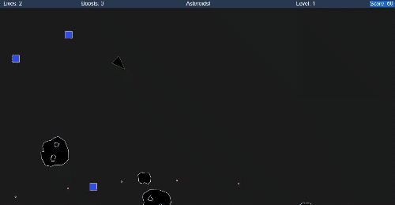

# Asteroids
Asteroids Game created in TypeScript using Observables  
A game created for a university assignment achieving a final score of 94/100  

## Accessing the game
- [Play the game here!](https://hyunshim.github.io/Asteroids/)  
or  
- Clone this repo and run `index.html`

## Editing the game
- Ensure you have [Node.js](https://nodejs.org/en/download/) installed
- Ensure you have TypeScript installed `npm install typescript`
- Run `tsc --watch` so that the code can be transpiled into JavaScript
- Functionality of the game can be edited by changing the **asteroids.ts** file in the root folder
- Open `index.html` in any browser to play the game!

## Controls
- _**w**_ key to move forward
- _**left mouse click**_ to fire a bullet
- _**right mouse click**_ to use boost

## Items
- _**Blue box**_ will increase the size of the bullet
- _**Green box**_ will increase the number of concurrent bullets
Acquiring the same item type will stack; stacks will be lost upon acquiring a different item type

## Enemies
- Enemies will fire bullets
- Killing an enemy acquires **+30** points

## Meteors
- Big meteors will break up into three smaller meteors
- Destroying a big meteor acquires **+20** points
- Destroying a small meteor acquires **+5** points
